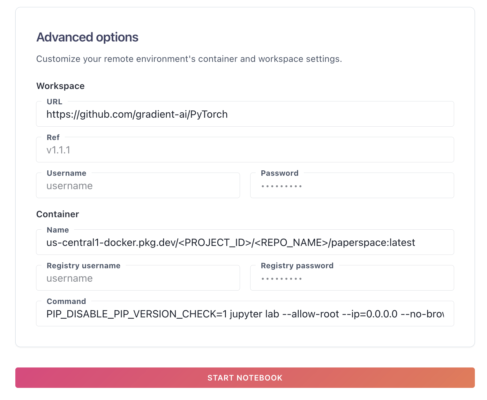

# My personal image to start notebooks in Paperspace

This image is based on [pt211-tf215-cudatk120-py311-20240202](https://hub.docker.com/r/paperspace/gradient-base/tags)

## Building

Run `docker build .` and then `docker image ls` and note the `IMAGE_ID` of the image just built. Tag the image with:

```bash
docker tag <IMAGE_ID> us-central1-docker.pkg.dev/<PROJECT_ID>/<REPO_NAME>/paperspace:latest
```

This is to use [Google Cloud Artifact](https://cloud.google.com/artifact-registry/docs/docker) (the replacement of GCR) in region `us-central1`: replace `PROJECT_ID` and `REPO_NAME` with the right values for your case.

To push the image, make sure you are authenticated and follow the instructions in https://cloud.google.com/artifact-registry/docs/docker/pushing-and-pulling. You might need to run, for example, `gcloud auth configure-docker us-central1-docker.pkg.dev` to be able to push.

```bash
docker push us-central1-docker.pkg.dev/<PROJECT_ID>/<REPO_NAME>/paperspace
```

## Use it in Paperspace Gradient

To start a container with this image, click the "Show advanced options" button when starting a notebook, and put your container repo URL in the Container > Name input:




## Mount a CGS volume

Refresh your authentication token
```bash
gcloud auth application-default login
```

And mount the bucket
```bash
mkdir $HOME/gcs_bucket
gcsfuse --implicit-dirs my-bucket $HOME/gcs_bucket
```

The --implicit-dirs kaggle-2024-rsna option is important if you [want to be able to read files (blobs) created prior to using fuse](https://github.com/GoogleCloudPlatform/gcsfuse/blob/master/docs/semantics.md#files-and-directories).

